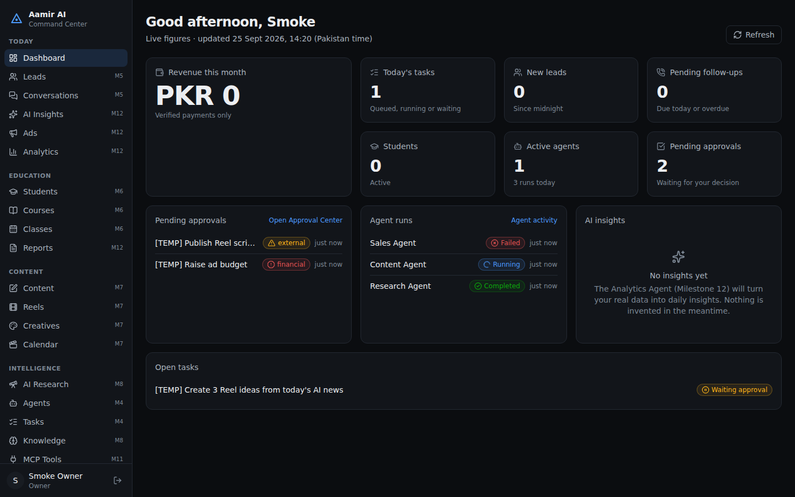

# Aamir AI Command Center

A personal multi-agent **AI Business Operating System** for running an AI education business: leads, WhatsApp,
students and courses, content, research, marketing, analytics and automations. An Orchestrator Agent sends work
to specialist agents, and a human approves anything that leaves the system.

> Status: **Milestone 5 complete** (… Orchestrator with 8 specialists, Leads + scoring, WhatsApp inbox with agent-drafted replies). See [`docs/IMPLEMENTATION_PLAN.md`](docs/IMPLEMENTATION_PLAN.md).

## Quick start (local)

Requirements: Node 22+, pnpm 10+, and either Docker or local PostgreSQL 16 with pgvector.

```bash
pnpm install
cp .env.example .env            # set SESSION_SECRET, ACC_ENCRYPTION_KEY and ANTHROPIC_API_KEY
                                # (no key yet? ACC_ENABLE_MOCKS=true runs a labelled mock model in dev)
docker compose up -d            # Postgres (pgvector) + Redis
pnpm db:migrate
OWNER_EMAIL=you@example.com OWNER_NAME="Aamir" OWNER_PASSWORD='a-long-passphrase' pnpm db:create-owner
pnpm dev:api                    # http://localhost:4000/api/health
pnpm dev:worker                 # executes agent tasks from the Redis queue
pnpm dev:web                    # http://localhost:5173 — sign in with the owner account
pnpm test                       # needs the acc_test database (created by docker compose)
E2E_EMAIL=... E2E_PASSWORD=... pnpm e2e   # browser smoke test (API + web must be running)
pnpm whatsapp:simulate --name "Ali" "Salam, fee kitni hai?"   # signed test message → real webhook (dev only)
```



## Docs
- [Architecture](docs/ARCHITECTURE.md) · [Decisions](docs/DECISIONS.md) · [Implementation plan](docs/IMPLEMENTATION_PLAN.md)
- [Security model](docs/SECURITY_MODEL.md) · [Agent architecture](docs/AGENT_ARCHITECTURE.md)
- [MCP architecture](docs/MCP_ARCHITECTURE.md) · [MCP servers](docs/MCP_SERVERS.md)
- [Database design](docs/DATABASE_DESIGN.md) · [API](docs/API.md)
